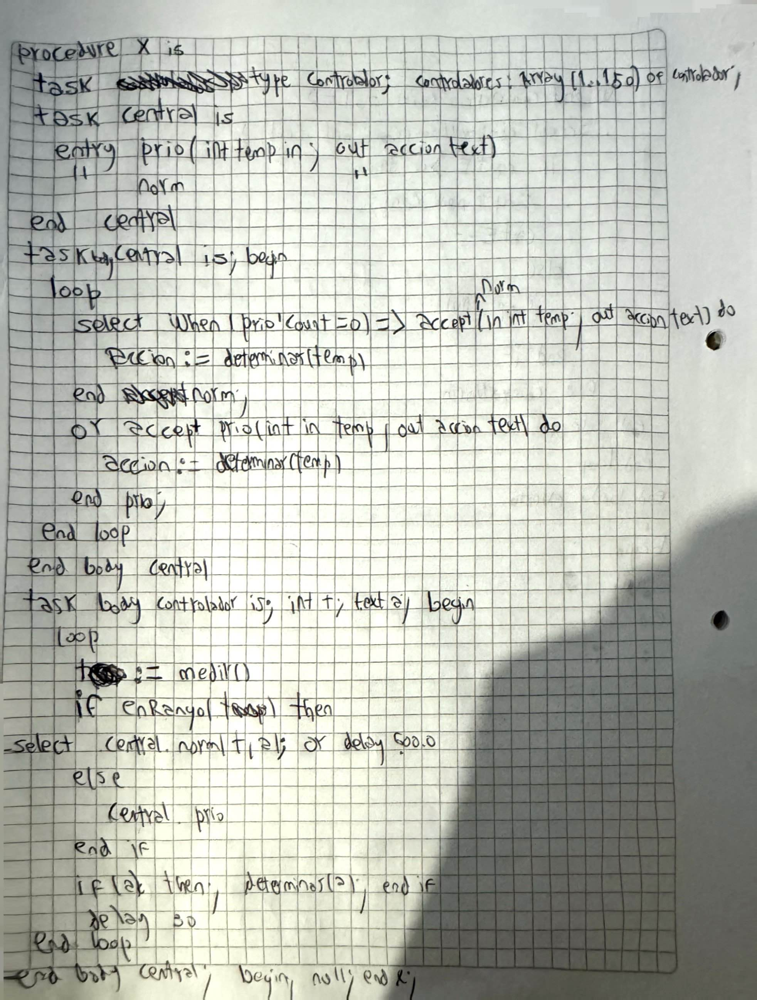

# MD del 08-11-22
## PMA
1. Resolver con PMA el siguiente problema. Se debe modelar el funcionamiento de una casa de venta de repuestos 
automotores, en la que trabajan V vendedores y que debe atender a C clientes. El modelado debe considerar que: 
(a) cada cliente realiza un pedido y luego espera a que se lo entreguen; y (b) los pedidos que hacen los clientes son 
tomados por cualquiera de los vendedores. Cuando no hay pedidos para atender, los vendedores aprovechan para 
controlar el stock de los repuestos (tardan entre 2 y 4 minutos para hacer esto). Nota: maximizar la concurrencia.
```cpp
chan vendedorLibre(int); 
chan pedidos(int, text); 
chan pedidosV[V](int, text); 
chan respuesto[C](text);

process vendedor[id:1..V]{
    int idC;
    text pedido;
    while(true){
        send vendedorLibre(id)
        receive pedidosV[id](idC, pedido)
        if idC != null {
            delay(2..4)
        } else {
            text respuesto = hacerRespuesto(pedido)
            send respuesto[idC](respuesto)
        }
    }
}

process coordinador{
    int idV, idC;
    text pedido;
    while(true){
        receive vendedorLibre(idV)
        if !empty(pedidos) {
            receive pedidos (idC, pedido)
            send pedidosV[idV](idC, pedido)
        } else {
            send pedidosV[idV](null, null)
        }
    }
}

process cliente[id:1..C]{
    text pedido = generarPedido();
    send pedidos(id, pedido)
    text respuesto;
    receive respuesto[id](respuesto)
}
```

## ADA
2. Resolver  con  ADA  el  siguiente  problema.  Se  quiere  modelar  el  funcionamiento  de  un  banco,  al  cual  llegan 
clientes  que  deben  realizar  un  pago  y  llevarse  su  comprobante.  Los  clientes  se  dividen  entre  los  regulares  y  los premium,  habiendo  R  clientes  regulares  y  P  clientes  premium.  Existe  un  único  empleado  en  el  banco,  el  cual 
atiende  de  acuerdo  al  orden  de  llegada,  pero  dando  prioridad  a  los  premium  sobre  los  regulares.  Si  a  los  30 
minutos de llegar un cliente regular no fue atendido, entonces se retira sin realizar el pago. Los clientes premium 
siempre esperan hasta ser atendidos.
```sh
PROCEDURE banco IS
    TASK TYPE regular IS
    END cliente;    
    TASK TYPE premium IS
    END cliente;    
    TASK empleado IS
        ENTRY atenderPrioritario(pago: IN text, comprobante: OUT text);
        ENTRY atenderRegular(pago: IN text, comprobante: OUT text);
    END empleado;
    regulares: array(1..R) of regular;
    premium: array(1..P) of premium;
    TASK BODY empleado IS
    BEGIN
        LOOP
            SELECT
                WHEN (atenderPrioritario`count = 0) =>
                    ACCEPT atenderRegular(pago: IN text, comprobante: OUT text) DO
                        comprobante := atender(pago);
                    END atenderRegular;
            OR
                ACCEPT atenderPrioritario(pago: IN text, comprobante: OUT text) DO
                    comprobante := atender(pago);
                END atenderPrioritario;
                ACCEPT 
        END LOOP;
        TASK BODY regular IS
            SELECT  
                empleado.atenderRegular(pago, comprobante)
            OR
                DELAY 1800.0
        END
        TASK BODY premium IS
            SELECT  
                empleado.atenderRegular(pago, comprobante)
        END
    END BODY empleado;

BEGIN

END banco;
```
# Programación Concurrente ATIC – Redictado de Programación Concurrente 
##  Segunda Fecha - 01/07/2021 

### PMA
2. Resolver  el  siguiente  problema  con  Pasaje  de  Mensajes  Asincrónicos  (PMA).  En  una  empresa  de
software  hay  3  programadores  que  deben  arreglar  errores  informados  por  N  clientes.  Los  clientes
continuamente están trabajando, y cuando encuentran un error envían un reporte a la empresa para que lo
corrija (no tienen que esperar a que se resuelva). Los programadores resuelven los reclamos de acuerdo al
orden de llegada, y si no hay reclamos pendientes trabajan durante una hora en otros programas. Nota: los
procesos  no  deben  terminar  (trabajan  en  un  loop  infinito);  suponga  que  hay  una  función ResolverError  que
simula que un programador está resolviendo un reporte de un cliente, y otra Programar que simula que está
trabajando en otro programa
```cpp
chan PLibre(int)
chan errores(text)
chan errorP[3](text)
process Programador[id:1..3]{
    while(true):
        send PLibre(id)
        text error;
        receive errorP[id](error)
        if (error != null){
            ResolverError(error)
        } else {
            Programar()
        }
}
process Cliente[1..N]{
    while(true):
        send errores(encontrarError())
}
process Coordinador{
    while(true):
        int idP
        receive PLibre(idP)
        if !empty(errores){
            text error
            receive errores(error)
            send errorP[idP](error)
        } else {
            send errorP[idP](null)
        }
}
```

### ADA
3. Resolver  el  siguiente  problema  con  ADA.  Hay  un  sitio  web  para  identificación  genética  que  resuelve
pedidos  de  N  clientes.  Cada  cliente  trabaja  continuamente  de  la  siguiente  manera:  genera  la  secuencia  de
ADN, la envía al sitio web para evaluar y espera el resultado; después de esto puede comenzar a generar la
siguiente secuencia de ADN. Para resolver estos pedidos el sitio web cuenta con 5 servidores idénticos que
atienden los pedidos de acuerdo al orden de llegada (cada pedido es atendido por un único servidor). Nota: 
maximizar  la  concurrencia.  Suponga  que  los  servidores  tienen  una  función  ResolverAnálisis  que  recibe  la
secuencia de ADN y devuelve un entero con el resultado
```java
PROCEDURE web IS
    TASK coordinador IS 
       ENTRY recibirMuestra(muestraR IN text, idR IN Integer)
       ENTRY darMuestra(muestraD: OUT text, idD OUT Integer)
    END coordinador;
    TASK BODY coordinador IS
    BEGIN
        LOOP 
            ACCEPT darMuestra(muestraD: OUT text, idD OUT Integer) DO // Servidores viene agarrar la muestra
                ACCEPT recibirMuestra(muestraR IN text, idR IN Integer) DO  //Esperamos un cliente, usamos cols implicitas
                    muestraD, idD := muestraR, idR;
                END recibirMuestra;
            END darMuestra;
        END LOOP 
    END BODY coordinador;

    TASK TYPE cliente IS 
        ENTRY getID(idn IN Integer)
        ENTRY recibirResolucion(resolucion IN text);
    END cliente;
    clientes : array(1..N) of cliente;
    TASK BODY cliente IS 
        id:Integer, resolucion: text;
    BEGIN
        ACCEPT getID(idn IN Integer) DsO
            id:=idn
        END getID;
        LOOP 
            coordinador.recibirMuestra(generarMuestra(), id)
            ACCEPT recibirResolucion(resolucion IN text) DO
                resolucion:=resolucion;
            END recibirResolucion;
        END LOOP;
    END BODY cliente;

    TASK TYPE servidor; 
    servidores: array (1..5) of servidor;
    TASK BODY servidor IS 
        muestra, resolucion: text; idC : Integer;
    BEGIN
        LOOP
            coordinador.darMuestra(muestra, idC)
            resolucion := ResolverAnálisis(muestra)
            cliente[idC].recibirResolucion(resolucion)
        END LOOP;
    END BODY servidor;
BEGIN 
    FOR i IN 1..N LOOP 
        clientes(i).getID(i)
    END LOOP
END web;
```

# Programación Concurrente ATIC – Redictado de Programación Concurrente 
## Tercera Fecha - 15/07/2021

### PMS
2. Resolver el siguiente problema con Pasaje de Mensajes Sincrónicos (PMS). En una excursión hay una 
tirolesa que debe ser usada por 20 turistas. Para esto hay un guía y un empleado. El empelado espera a 
que  todos  los  turistas  hayan  llegado  para  darles  una  charla explicando  las  medidas  de  seguridad.  Cuando  
termina  la  charla  los  turistas  piden  usar  la  tirolesa  y  esperan  a  que  el  guía  les  vaya  dando  el  permiso  de  
tirarse.  El  guía  deja  usar  la  tirolesa  a  un  cliente a  la  vez y  de  acuerdo  al  orden  en  que  lo  van  solicitando. 
Nota: todos los procesos deben terminar;  suponga que el empleado tienen una función DarCharla() que 
simula que el empleado está dando la charla, y los turistas tienen una función UsarTitolesa() que simula que 
está usando la tirolesa. 
```cpp 
process turista[id:1..20]{
    empleado!llegoTurista()
    empleado!terminoCharla()
    buffer!pedirTirolesa(id)
    guia?pasar()
    // tirarse
    guia!termine()
}
process buffer {
    int cantEncolados; cola queue;
    do
        cantEncolados < 20; turista?pedirTirolesa(id) -> cola.push(id); cantEncolados++;
        [] !cola.isEmpty(); guia?siguiente() -> guia!recibirID(cola.pop())
    od
}
process guia{
    int idP
    for i:=1..20 {
        buffer!siguiente()
        buffer?recibirID(idP)
        turista[idP]!pasar()
        turista[idP]?termine()
    }
}
process empleado {
    for i:=1..20 {
        turista[*]?llegoTurista()
    }
    // dar charla
    for i:=1..20 {
        turista[*]?terminoCharla()
    }
}
```

### ADA
3. Resolver el siguiente problema con ADA. En un negocio hay un empleado para atender los pedidos de 
clientes  de  N  clientes;  algunos  clientes  son  ancianos  o  embarazadas.  El  empleado  atiende  los  pedidos  de  
acuerdo a la siguiente prioridad: primero las embarazadas, luego los ancianos, y por último el resto. Cada 
cliente  hace  sólo  un  pedido  de  la  siguiente  manera:  en  el  caso  de  las  embarazadas,  si  no  son  atendidas  
inmediatamente se retiran; en el caso de los ancianos, esperan a los sumo 5 minutos a ser atendidos, y si 
no se retira; cualquier otro cliente espera si o si hasta ser atendido. El empleado atiende a los clientes de 
acuerdo al orden de llegada pero manteniendo las siguientes prioridades: primero las embarazadas, luego 
los  ancianos  y  luego  el  resto.  Nota:  suponga  que  existe  una  función  AtenderPedido()  que  simula  que  el  
empleado está atendiendo a un cliente.
```SH
PROCEDURE negocio IS
    TASK empleado IS
        ENTRY atencionEmbarazada()
        ENTRY atencionAnciano()
        ENTRY atencionNormal()
    END empleado;
    TASK TYPE cliente;
    TASK BODY cliente IS
        tipo := ...;
    BEGIN
        IF tipo = 'normal' THEN
            empleado.atencionNormal();
        ELSE IF tipo = 'anciano' THEN
            SELECT empleado.atencionAnciano();
            OR DELAY 300.0;
        ELSE IF tipo = 'embarazada' THEN
            SELECT empleado.atencionEmbarazada();
            ELSE;
        END IF;
    END BODY cliente;
    clientes : array (1..N) of cliente;
    TASK BODY empleado IS
        LOOP
            SELECT
                ACCEPT atencionEmbarazada() DO
                    AtenderEmpleado();
                END atencionEmbarazada();
            OR
                WHEN (atencionEmbarazada`count = 0) => ACCEPT atencionAnciano() DO
                    AtenderEmpleado();
                END atencionAnciano();
            OR
                WHEN (atencionAnciano`count = 0  AND atencionEmbarazada`count = 0) => ACCEPT atencionNormal() DO
                    AtenderEmpleado();
                END atencionNormal();
            END SELECT;
        END LOOP;
    END BODY empleado;
BEGIN 
    null;
END negocio;
```
### PMS
1. Resolver con Pasaje de Mensajes Sincrónicos (PMS) el siguiente problema. En un comedor estudiantil hay un horno microondas 
que debe ser usado por E estudiantes de acuerdo con el orden de llegada. Cuando el estudiante accede al horno, lo usa y luego se 
retira para dejar al siguiente. Nota: cada Estudiante una sólo una vez el horno.
```cpp
process estudiante[id:1..E]{
    horno!pedirAcceso(id) 
    horno?recibirAcceso()
    //usar
    horno!liberar()
}
process horno{
    cola queue, libre = false
    do
        estudiante[*]?pedirAcceso(idP) -> 
            if(libre){
                estudiante[idP]!recibirAcceso()
                libre = false
            } else {
                cola.push(idP)
            }
        [] estudiante[*]?liberar(); -> 
            if(!empty(cola)){
                estudiante[cola.pop()]!recibirAcceso()
            } else {
                libre = true;
            }
    od
}
```

### ADA
2. Resolver  con  ADA  el  siguiente  problema.  Se  debe  controlar  el  acceso  a  una  base  de  datos.  Existen  L  procesos  Lectores  y  E procesos Escritores que trabajan indefinidamente de la siguiente manera: 
• Escritor:  intenta  acceder  para  escribir,  si  no  lo  logra  inmediatamente,  espera  1  minuto  y  vuelve  a  intentarlo  de  la  misma manera. 
• Lector: intenta acceder para leer, si no lo logro en 2 minutos, espera 5 minutos y vuelve a intentarlo de la misma manera. 
Un proceso Escritor podrá acceder si no hay ningún otro proceso  usando la base de datos; al acceder escribe y sale de la BD. Un 
proceso Lector podrá acceder si no hay procesos Escritores usando la base de datos; al acceder lee y sale de la BD. Siempre se le 
debe dar prioridad al pedido de acceso para escribir sobre el pedido de acceso para leer. 
```SH
PROCEDURE acceso IS
    TASK TYPE escritor;
    TASK TYPE lector;

    TASK BODY escritor IS
        LOOP
            SELECT db.accesoEscritor();
                //escribir
                db.irseEscritor()
            ELSE 
                DELAY 60.0;           
            END SELECT;
        END LOOP;
    END BODY escritor;
    TASK BODY lector IS
        LOOP
            SELECT
                db.accesoLector();
                //leer
                db.irseLector();
            OR DELAY 120.0;
                DELAY 300.0
            END SELECT;
        END LOOP;
    END BODY lector;

    TASK db IS
        ENTRY accesoLector();
        ENTRY accesoEscritor();
        ENTRY irseLector();
        ENTRY irseEscritor()
    END;
    TASK BODY db IS
        cantLectores: Int:=0; cantEscritores:Int:=0;
    BEGIN
        LOOP
            SELECT WHEN(accesoEscritor`count = 0 AND irseEscritor`count = 0 AND irseLector`count = 0 AND cantEscritores= 0 ) =>
                ACCEPT accesoLector();
                cantLectores++;
            OR WHEN(irseEscritor`count = 0 AND irseLector`count = 0 AND cantLectores= 0 AND cantEscritores = 0) =>
                ACCEPT accesoEscritor();
                cantEscritor++;
            OR 
                ACCEPT irseLector();
                cantLector--;
            OR 
                ACCEPT irseEscritor();
                cantEscritor--;
            END SELECT;
        END LOOP;
    END db;
BEGIN
    null
END;
```
 
# primer recuperatorio del parcial práctico

### PMS
1. Resolver con Pasaje de Mensajes Sincrónicos (PMS) el siguiente problema. En un torneo de programación 
hay 1 organizador, N competidores y S supervisores. El organizador comunica el desafío a resolver a cada 
competidor. Cuando un competidor cuenta con el desafío a resolver, lo hace y lo entrega para ser evaluado. 
A continuación, espera a que alguno de los supervisores lo corrija y le indique si está bien. En caso de tener 
errores, el competidor debe corregirlo y volver a entregar, repitiendo la misma metodología hasta que llegue 
a la solución esperada. Los supervisores corrigen las entregas respetando el orden en que los competidores 
van entregando. Nota: maximizar la concurrencia y no generar demora innecesaria.
```cpp
process organizador:
    for i:= 1..N:
        idC: int
        competidor[*]?llego(idC)
        competior[idC]!desafio(nuevoDesafio())

process competidor[id:1..N]:
    organizador!llego(id)
    desafio: text
    organizador?desafio(desafio)
    res = resolver(desafio)
    buffer!recibirProblema(id, res)
    correcion:text
    supervisor[*]?correcion(correcion)
    while correcion:
        res = resolver(desafio, correcion)
        buffer!recibirProblema(id, res)
        supervisor[*]?correcion(correcion)

process supervisor[id:1..S]:
    while true:
        buffer!libre(id)
        idC: int, problema: text
        buffer?correcion(idC, problema)
        // corregir
        competidor[idC]!correcion(null);

process buffer:
    cola = Queue()
    do
        competidor[*]?recibirProblema(id, problema) -> cola.push(id, problema)
        [] ! cola.empty(); supervisor[*]?libre(idS) -> supervisor[idS]!correcion(cola.pop())
    od
```

### ADA
2. Resolver con ADA el siguiente problema. Una empresa de venta de calzado cuenta con S sedes. En la oficina 
central de la empresa se utiliza un sistema que permite controlar el stock de los diferentes modelos, ya que 
cada sede tiene una base de datos propia. El sistema de control de stock funciona de la siguiente manera: 
dado un modelo determinado, lo envía a las sedes para que cada una le devuelva la cantidad disponible en 
ellas; al final del procesamiento, el sistema informa el total de calzados disponibles de dicho modelo. Una 
vez que se completó el procesamiento de un modelo, se procede a realizar lo mismo con el siguiente modelo. 
Nota: suponga que existe una función DevolverStock(modelo,cantidad) que utiliza cada sede donde recibe 
como parámetro de entrada el modelo de calzado y retorna como parámetro de salida la cantidad de pares 
disponibles. Maximizar la concurrencia y no generar demora innecesaria
```SH
// HAY UNO MUY SIMILAR EN LA DE REPASO
```

# Programacion_Concurrente___Resolucion_Examenes_MD
## Parcial MC - 2020 - 1 - Tema 6

### PMA
Resolver con PASAJE DE MENSAJES ASINCRÓNICOS (PMA) el siguiente problema. Se debe simular la atención en un banco con 3 cajas para atender a N clientes que pueden ser especiales (son las embarazadas y los ancianos) o regulares. Cuando el cliente llega al banco se dirige a la caja con menos personas esperando y se queda ahí hasta que lo terminan de atender y le dan el comprobante de pago. Las cajas atienden a las personas que van a ella de acuerdo al orden de llegada pero dando prioridad a los clientes especiales; cuando terminan de atender a un cliente le debe entregar un comprobante de
pago. Nota: maximizar la concurrencia. Respuesta:
```cpp
chan clienteLlego(int)
chan asignarCaja[int](int)
chan colaRegular[3](int)
chan colaPrioritaria[3](int)
chan clienteEnCaja[3](bool)
chan comprobantesCliente[int](text)
chan cajaLibre(int)
chan accion(bool)
process caja[id:1..3]{
    while(true){
        int idCliente
        receive clienteEnCaja[id]()
        if (!empty(colaPrioritaria[id])){
            receive colaPrioritaria[id](idCliente)
        } else {
            receive colaRegular[id](idCliente)
        }
        comprobante = procesarCliente(idCliente)
        send comprobantesCliente[idCliente](comprobante)
        send cajaLibre(id)
        send accion()
    }
}
process coordinador{
    int clientesEnCaja[3] = (0,0,0), int cajaMinima, idCliente, idCaja
    while (true) {
        receive accion()
        if !empty(clienteLlego) -> 
            receive clienteLlego(idCliente)
            cajaMinima = encontrarCajaMinima(clientesEnCaja)
            send asignarCaja[cajaMinima](idCliente)
            clientesEnCaja[cajaMinima] ++
        [] !empty(cajaLibre); -> 
            receive cajaLibre(idCaja)
            clientesEnCaja[idCaja] --
    }
}
process cliente[id:1..P]{
    int cajaAsignada; text comprobante; bool esPrioritario = ...;
    send clienteLlego(id)
    send accion()
    receive asignarCaja[id](cajaAsignada)
    if (esPrioritario){
        send colaPrioritaria[cajaAsignada](id)
    } else {
        send colaRegular[cajaAsignada](id)
    }
    send clienteEnCaja[cajaAsignada]();
    receive comprobantesCliente[id](comprobante)
}
```
### PMS
Resolver con PMS (Pasaje de Mensajes SINCRONICOS) el
siguiente problema. En una exposición aeronáutica hay un simulador de vuelo (que debe ser usado con exclusión mutua) y un empleado encargado de
administrar el uso del mismo. A su vez hay P personas que van a la exposición y solicitan usar el simulador, cada una de ellas espera a que el empleado lo
deje acceder, lo usa por un rato y se retira para que el empleado deje pasar a otra persona. El empleado deja usar el simulador a las personas respetando
el orden en que hicieron la solicitud. Nota: cada persona usa sólo una vez el simulador. Respuesta:
```SH
// ES EL DE LA PRACTICA 
```

### PMS
Resolver con PMS (Pasaje de Mensajes SINCRÓNICOS) el siguiente problema. Simular la atención de una estación de servicio con un único surtidor que
tiene un empleado que atiende a los N clientes de acuerdo al orden de llegada. Cada cliente espera hasta que el empleado lo atienda y le indica qué y
cuánto cargar; espera hasta que termina de cargarle combustible y se retira. Nota: cada cliente carga combustible sólo una vez; todos los procesos deben
terminar. Respuesta:
```cpp
process Empleado{
    int idC, cantidad; text tipo
    for i:=1..N {
        Buffer!siguiente()
        Buffer?recibir(idC)
        Cliente[idC]?seleccion(tipo, cantidad)
        // Surtir
        Cliente[idC]!termino()
    }
}
process Buffer {
    cola Queue; cantAtentidos int
    do
        cantAtendidos < 20; Cliente[*]?llegue(idC) -> cola.push(idC); cantAtendidos++;
        [] ! cola.isEmpty(); Empleado?siguiente() -> Empleado!recibir(cola.pop())
    od
}
process Cliente[id:1..N]{
    Buffer!llegue(id)
    Empleado!seleccion(elegirTipo(), elegirCantidad())
    Empleado?termino()
}
```

### PMS
En una carrera hay C corredores y 3 Coordinadores. Al llegar los corredores deben dirigirse a los coordinadores para que cualquiera de ellos le dé el número
de “chaleco” con el que van a correr y luego se va. Los coordinadores atienden a los corredores de acuerdo al orden de llegada (cuando un coordinador está
libre atiende al primer corredor que está esperando). Nota: maximizar la concurrencia. Respuesta
```cpp
process Coordinador[id:1..3] {
    int idC
    Buffer!siguiente(id)
    Buffer?recibir(idC)
    Corredor[idC]!recibirChaleco(new Chaleco())
}
process Corredor[id:1..C]{
    text chaleco;
    Buffer!llegue(id)
    Empleado[*]?recibirChaleco(chaleco)
}
process Buffer {
    cola Queue; cantAtentidos int
    do
        cantAtendidos < 20; Corredor[*]?llegue(idC) -> cola.push(idC); cantAtendidos++;
        [] ! cola.isEmpty(); Coordinador[*]?siguiente(idC) -> Coordinador[idC]!recibir(cola.pop())
    od
}
```
### ADA
Consigna:
2- Resolver con ADA la siguiente situación. En una obra social que tiene 15 sedes en diferentes lugares se tiene información de las enfermedades de cada
uno de sus clientes (cada sede tiene sus propios datos). Se tiene una Central donde se hacen estadísticas, y para esto repetidamente elige una enfermedad
y debe calcular la cantidad total de clientes que la han tenido. Esta información se la debe pedir a cada Sede. Maximizar la concurrencia. Nota: existe
una función ElegirEnfermos(e) que es llamada por cada Sede y devuelve la cantidad de clientes de esa sede que han tenido la enfermedad e.
Respuesta:


### ADA
En un sistema para acreditar carreras universitarias, hay UN Servidor que atiende pedidos de U Usuarios de a uno a la vez y de acuerdo con el orden en
que se hacen los pedidos. Cada usuario trabaja en el documento a presentar, y luego lo envía al servidor; espera la respuesta de este que le indica si está
todo bien o hay algún error. Mientras haya algún error,vuelve a trabajar con el documento y a enviarlo al servidor. Cuando el servidor le responde que
está todo bien, el usuario se retira. Cuando un usuario envía un pedido espera a lo sumo 2 minutos a que sea recibido por el servidor, pasado ese tiempo
espera un minuto y vuelve a intentarlo (usando el mismo documento). Respuesta:


### ADA
Resolver con ADA el siguiente problema. Simular la venta de entradas a un evento musical por medio de un portal web. Hay N clientes que intentan
comprar una entrada para el evento; los clientes pueden ser regulares o especiales (clientes que están asociados al sponsor del evento). Cada cliente especial
hace un pedido al portal y espera hasta ser atendido; cada cliente regular hace un pedido y si no es atendido antes de los 5 minutos, vuelve a hacer el
pedido siguiendo el mismo patrón (espera a lo sumo 5 minutos y si no lo vuelve a intentar) hasta ser atendido. Después de ser atendido, si consiguió
comprar la entrada, debe imprimir el comprobante de la compra.
El portal tiene Z entradas para vender y atiende los pedidos de acuerdo al orden de llegada pero dando prioridad a los Clientes Especiales. Cuando
atiende un pedido, si aún quedan entradas disponibles le vende una al cliente que hizo el pedido y le entrega el comprobante.
Nota: no debe modelarse la parte de la impresión del comprobante, sólo llamar a una función Imprimir (comprobante) en el cliente que simulará esa
parte; la cantidad E de entradas es mucho menor que la cantidad de clientes (E « C); todas las tareas deben terminar.
Respuesta:


### ADA
Resolver con ADA el siguiente problema. Simular la atención en una oficina donde atiende un empleado. Hay N personas que deben hacer UN trámite
cada uno. Cuando una persona llega le da los datos al empleado y espera a que este resuelva el trámite y le entregue un comprobante. Por otro lado está el
director de la oficina, el cual necesita 5 informes del empleado; cada vez que necesita un informe se lo pide al empleado y si no lo atiende inmediatamente
sigue trabajando durante 10 minutos y luego lo vuelve a intentar siguiendo el mismo patrón (si no lo atiende inmediatamente trabaja durante 10 minutos
y luego lo vuelve a intentar) hasta que el empleado lo atienda y le dé el informe pedido. El empleado atiende los pedidos de acuerdo al orden de llegada
pero siempre dando prioridad a los pedidos de las personas. Nota:
todas las tareas deben terminar. Respuesta:

# SIGUIENTE

### ADA
Resolver con ADA el siguiente problema. Un programador contrató a 5 estudiantes para testear los sistemas desarrollados por él. Cada estudiante tiene
que trabajar con un sistema diferente y debe encontrar 10 errores (suponga que seguro existen 10 errores en cada sistema) que pueden ser: urgentes,
importantes, secundarios. Cada vez que encuentra un error se lo reporta al programador y espera hasta que lo resuelva para continuar. El programador
atiende los reportes de acuerdo al orden de llegada pero teniendo en cuenta las siguientes prioridades: primero los urgentes, luego los importantes y por
último los secundarios; si en un cierto momento no hay reportes para atender durante 5 minutos trabaja en un nuevo sistema que está desarrollando. De-
spués de resolver los 50 reportes de error (10 por cada estudiante) el programador termina su ejecución. Nota: todas las tareas deben terminar. Respuesta:
```SH
```

### PMA
2) Resolver con PMA el siguiente problema. Para una aplicación de venta de pasaje se tienen 3 servidores replicados para mejorar la eficiencia en la
atención. Existen N clientes que hacen alguna de estas dos solicitudes: compra de un pasaje o devolución de un pasaje. Las solicitudes se deben atender
dando prioridad a las solicitudes de compra. Nota: suponga que cada cliente llama a la función TipoSolicitud() que le devuelve el tipo de solicitud a
realizar. Maximizar la concurrencia. Respuesta:
```SH
```

### ADA
Resolver con ADA el siguiente problema. Se debe simular un juego en el que participan 30 jugadores que forman 5 grupos de 6 personas. Al llegar cada
jugador debe buscar las instrucciones y el grupo al que pertenece en un cofre de cemento privado para cada uno; para esto deben usar un único martillo
gigante de a uno a la vez y de acuerdo al orden de llegada. Luego se debe juntar con el resto de los integrantes de su grupo y los 6 juntos realizan
las acciones que indican sus instrucciones. Cuando un grupo termina su juego le avisa a un Coordinador que le indica en qué orden término el grupo.
Nota: maximizar la concurrencia; suponer que existe una función Jugar() que simula que los 6 integrantes de un grupo están jugando juntos; suponga que
existe una función Romper(grupo) que simula cuando un jugador está rompiendo su cofre con el martillo y le retorna el grupo al que pertenece. Respuesta
```SH
```

### PMS
Resolver con PMS (Pasaje de Mensajes SINCRÓNICOS) el siguiente problema. Hay un teléfono público que debe ser usado por U usuarios de acuerdo al
orden de llegada (se debe usar con exclusión mutua). El usuario debe esperar su turno, usa el teléfono y luego lo deja para que el siguiente lo use. Nota:
cada usuario usa sólo una vez el teléfono. Respuesta:
```SH
```

# Extra
### ADA
Resolver con ADA el siguiente problema. Para un experimento se tiene una red con 150 controladores de temperatura y un módulo central. Cada controlador toma la temperatura cada 30 segundos y si está fuera de rango realiza lo siguiente: si está por encima del rango espera a que la central que le indique qué acción realizar; si está por debajo del rango espera a lo sumo 10 minutos a que la central le indique qué acción realizar; en cualquiera de los dos casos, realiza la acción indicada por la central (si fue atendido). La central atiende los pedidos de los controladores dando prioridad a aquellos que son por superar el rango permitido. Nota: suponga que existen las funciones medir() que retorna la temperatura al controlador; actualizar() que simula que el controlador está haciendo la acción indicada por la central; determinar() que es usado por la central para determinar qué acción debe hacer el controlador en base a la información que le envió; el experimento nunca finaliza.

